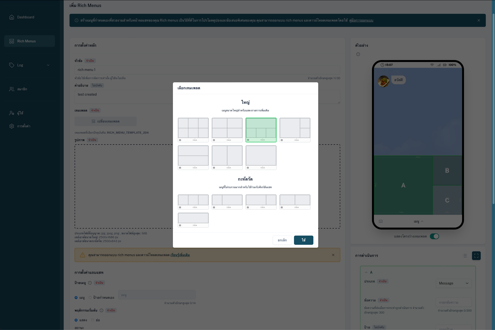
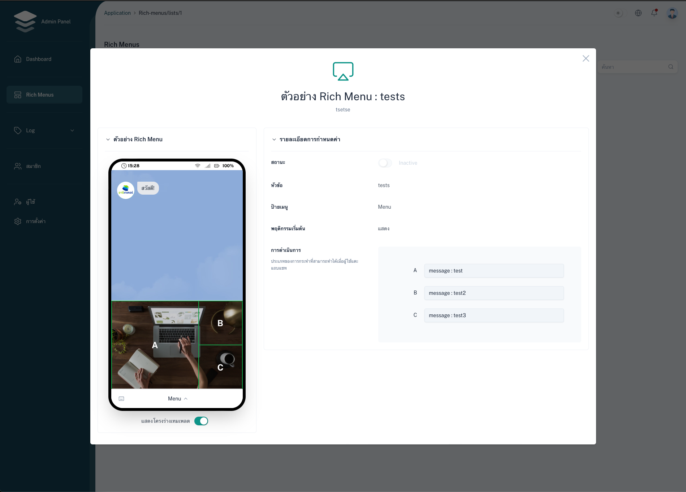

# sveltekit-line-richmenu-builder

copy line rich menu builder from official to sveltekit

## Feature

- create rich menu json template
- save data to nestjs via api & call line api to set rich menu

## Screenshots

